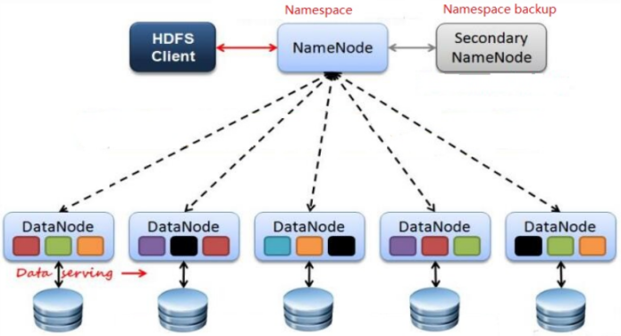

## **Hadoop**
+ **Hadoop是什么?**
  - 狭义：指Hadoop框架, 大数据必备框架, Apache下开源的分布式系统基础框架, 主要解决海量数据的存储和分析计算问题。
  - 广义：指Hadoop生态圈, 包含大量用于大数据储存, 管理, 传输, 分析计算的框架。
  

+ **Hadoop组成？**
  - Hadoop1.x MapReduce同时处理业务逻辑运算和资源调度, 耦合性高
  -  Hadoop2.x 进行改进, 增加Yarn, Yarn负责任务调度，MapReduce负责运算
  

+ **Hadoop生态圈组件**
  -  Zookeeper：是一个开源的分布式应用程序协调服务,基于zookeeper可以实现同步服务，配置维护，命名服务。
  -  Flume：一个高可用的，高可靠的，分布式的海量日志采集、聚合和传输的系统。
  - Hbase：是一个分布式的、面向列的开源数据库, 利用Hadoop HDFS作为其存储系统。、
  - Hive：基于Hadoop的一个数据仓库工具，可以将结构化的数据档映射为一张数据库表，并提供简单的sql 查询功能，可以将sql语句转换为MapReduce任务进行运行。
  - Sqoop：将一个关系型数据库中的数据导进到Hadoop的 HDFS中，也可以将HDFS的数据导进到关系型数据库中。

+ **Hadoop运行模式**
  -  单机版、伪分布式模式、完全分布式模式

### **HDFS**
+ **HDFS组成架构**

  - 架构主要由四个部分组成，分别为**HDFS Client、NameNode、DataNode和Secondary NameNode**。下面我们分别介绍这四个组成部分。
  - Client：就是客户端。
    -  （1）文件切分。文件上传HDFS的时候，Client将文件切分成一个一个的Block，然后进行存储；
    - （2）与NameNode交互，获取文件的位置信息；
    - （3）与DataNode交互，读取或者写入数据；
    - （4）Client提供一些命令来管理HDFS，比如启动或者关闭HDFS；
    - （5）Client可以通过一些命令来访问HDFS；
  - NameNode：就是Master，它是一个主管、管理者。
    - （1）管理HDFS的名称空间；
    - （2）管理数据块（Block）映射信息；
    - （3）配置副本策略；
    - （4）处理客户端读写请求。
  - DataNode：就是Slave。NameNode下达命令，DataNode执行实际的操作。
    - （1）存储实际的数据块；
    - （2）执行数据块的读/写操作。
  - Secondary NameNode：并非NameNode的热备。当NameNode挂掉的时候，它并不能马上替换NameNode并提供服务。
    - （1）辅助NameNode，分担其工作量；
    - （2）定期合并Fsimage和Edits，并推送给NameNode；
    - （3）在紧急情况下，可辅助恢复NameNode。

### MapReduce

### Yarn